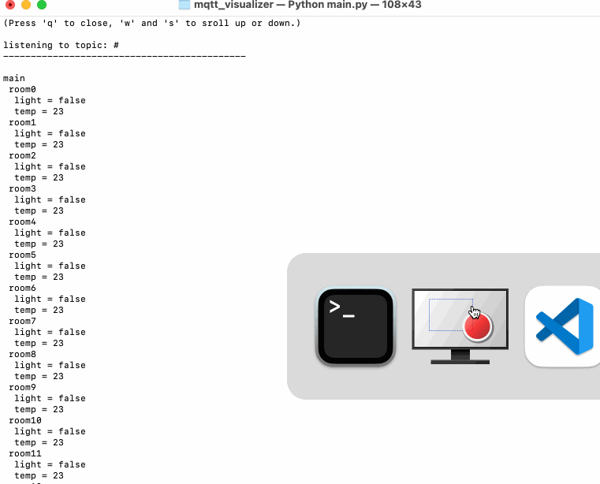

# mqtt_visualizer
Visualize MQTT data traffic in a terminal.



## Installation

### Unix based systems

Use python up to version 3.10.2

Install following modules

```pip3 install paho-mqtt```


## Arguments

| argument | description | default value
|----------|------------|---|
| -a | ip adress to the MQTT Broker| "127.0.0.1"
| -p | port number to use | 1883
| -t | topic to which to subscribe to| "#"
